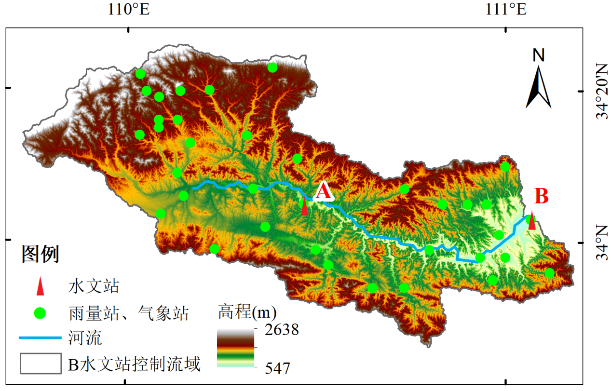
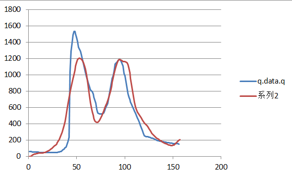

次洪模型和日模型的构建方法存在区别。

《水文预报 （第5版）》一书中，是通过日模型率定参数后代入次洪模型，并对部分参数进行调整。但是，不提供日流量数据时，如果进行次洪模型的构建。

**问题**：

- **如何推断场次洪水对应的降水开始时间。**流域较大时，上游降水较少的事件可能不会引起下游洪水，但是距全流域降水相隔时间又比较短（24h外，3d内），此时是否应该将上游雨量站降水数据纳入考虑。

- **面降雨量计算。**通常用泰森多边形划分各雨量站控制流域得到面积比例，然后根据面积权重计算流域面降雨量。但是，当发生局部强降水事件时，根据泰森多边形计算得到的值可能远小于局部降水值，即面积权重引起了误差。解决方法：应该是通过划分单元流域，计算每个单元流域的洪水过程。比如，在河流中游发生降水，和上游、下游都没有关系，只涉及到上游来水以及到下游的传播过程。

- **次洪模型如何进行率定。**比如说，从洪水数据中选出10场洪水，8场洪水用于率定，2场洪水用于验证。率定时，如果对每场洪水进行单独率定，将得到8套参数。但如果8场洪水合并为一个序列后进行率定，NSE作为目标函数，虽然整体效果还可以，但是对单场洪水模拟时，效果较差。

  我的理解是：场次洪水是离散数据，不能合并为一个序列进行率定。解决方法？

新安江模型采用的是R包：[hydroTools](https://github.com/CUG-hydro/HydroTools.R)

数据来源：[第四届水科学数值模拟创新大赛](http://www.ches.org.cn/chesweb/ggl/202405/t20240521_1747411.html)

研究区：

效果：

